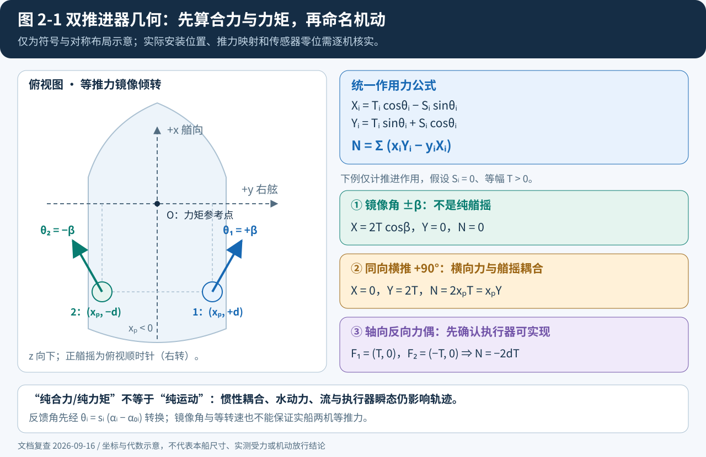

# 第 2 章 可辨识性分析

> 更新：2026-09-16。结论先行：运动拟合准确，不等于推进力、阻力及干扰系数分别可辨识。变 RPM 与瞬态激励能增加信息，但不能消除任意函数分解的歧义；双全回转推进器增加可设计的激励方式，也不意味着任意固定方位角下三个广义力都能独立控制。

**标注约定**：【文献】表示所链接来源支持的方法或现象；【推断】表示本项目代数推导、结构选择或待检验的工程假设。未测量的设备参数、不确定度和现场性能均不视为已知。

## 2.1 纵向推力–阻力耦合：何时可分、何时不可分

### 2.1.1 恒定 RPM 与变 RPM 都存在的函数歧义

先在静水、直航的简化子问题中，固定质量与附加质量、略去已另行处理的耦合力，定义装船有效推进力：

```text
M_u = m - X_u_dot
M_u * du/dt = T_eff(n, u) - R(u) = F(n, u)
T_eff = (1 - t_p) * T
```

这里的 `u` 在该静水子问题中同时等于对地与对水纵向速度；有流时必须改用 §2.2.1 与第 3 章的数据约定，不能把 GNSS 速度直接当作水动力来流。

**函数级不可辨识性**【推断，代数事实】：对任意满足选定光滑性条件的函数 `g(u)`，

```text
T_eff_new(n, u) = T_eff(n, u) + g(u)
R_new(u)        = R(u) + g(u)
```

得到的 `F(n,u)` 完全相同，因此在同一初态下产生相同速度、位置和加速度轨迹。这个变换对任意变化的 `n(t)` 仍成立；**不是只剩“一个可加常数”，加速度也不能分离两个任意函数**。恒定 RPM 还进一步限制了数据支持域；仅有定常自航点时只观测到若干 `F(n_j,u_j)=0`，连完整净力曲面都没有确定。

可用作实现前反例的无量纲合成对：

| 模型 | 有效推进项 | 阻力项 | 净力 |
|---|---|---|---|
| A | `n²` | `u²` | `n²-u²` |
| B | `n²+0.2u²` | `1.2u²` | `n²-u²` |

两者对任何转速序列给出相同净力。模型 B 不满足“零转速推进项为零”的结构约束，正好说明：分解由额外假设选定，而不是由瞬态运动数据自动给出。该表是数学反例，不是船舶实验结果。

### 2.1.2 有限参数模型中的条件可辨识

实用路线是选定低维结构，明确固定项、锚定信息与适用域，再检查该结构是否可辨识，而不是宣称“变 RPM + 一个自航点”已充分。示意【推断】：

```text
T_eff(n,u) = phi_T(n,u) * theta_T
R(u)      = phi_R(u)   * theta_R
M_u * du/dt = [phi_T(n,u), -phi_R(u)] * [theta_T; theta_R]
```

若两组基函数共享某个 `u` 项，设计矩阵存在重复/相关列；即便 `n` 变化，该自由度仍需移除、固定或由独立测量约束。对于指定线性参数回归，固定已知量后满列秩是无噪声唯一解条件；非线性参数模型还要检查局部灵敏度秩、多初值解和全局歧义。NN 权重通常本身不唯一，应检验输出映射及其不确定区间，不以某组权重稳定作为物理参数可辨识证据。

| 条件 | 必须提供的证据 | 不能替代它的材料 |
|---|---|---|
| 结构与力尺度 | 质量、惯量、附加质量的来源；固定/待辨识清单；推进与阻力不重复的基函数或明确约束 | 仅增加 NN 容量 |
| 激励 | 同一速度邻域内有不同转速/加减速响应；实际回归矩阵或输出灵敏度的秩与条件数 | 多个定常点沿单一自航曲线排列 |
| 锚定 | 独立推力/阻力信息，或声明并验证的低维结构假设；每项约束对应的自由度 | 一个系柱点用来约束任意速度函数 |
| 不确定度 | 航次/机动分组重采样、多个初值与模型结构比较、独立留出机动 | 训练 RMSE 很小 |
| 力与加速度区分 | 若总惯性与全部力尺度同时自由，先固定尺度或只报告加速度等价模型 | 从运动数据直接声称得到绝对牛顿值 |

`T_eff(0,u)=0` 只能作为**推进项的定义/简化假设**：停止、锁桨或风车状态下的附体/桨阻力应分配到哪个模块必须写清。即便用该约束固定函数在 `n=0` 的边界，没有覆盖该边界的数据仍不能保证有限数据下的辨识与外推。系柱数据主要约束近零进速处，不锚定整个航速范围。

【文献】Alexandersson 等的工作支持“逆动力学回归 + EKF/RTS 平滑 + 候选结构交叉验证”的路线，使用模型试验资料；不能据此推断本船在没有推力测量的条件下也能恢复各独立物理分量。[论文与作者机构记录](https://research.chalmers.se/en/publication/533328)、[作者公开分析代码](https://zenodo.org/records/7185475)

若采用 `T=ρ n²D⁴ K_T(J)` 形式，`n` 应为转/秒，`J=u_A/(nD)`；低阶 `K_T` 可写成 `k0+k1*J+k2*J²`，但这只是候选参数化。近零转速、倒车和四象限必须另定连续、有限的表达与数据域，不能直接计算含 `1/n` 的式子。没有敞水测量时，本项目优先报告装船**有效推进映射**，不命名为独立敞水曲线，也不由它直接计算轴功率。

### 2.1.3 分阶段训练的成立边界

建议依次辨识执行器响应 → 受约束的有效推进/纵向净力 → 船体残差，并在每次开放新模块前冻结上一版本。分阶段只是降低优化耦合的方法：上一阶段推力若是估计值，把它移到方程左侧不会变成无误差真值。应传播其不确定度，并用“不同分解是否给出同样运动拟合、却在新输入下分歧”检验是否仍有歧义。锚定不足时允许交付净力/加速度预测模型，但缩小物理解释范围。

## 2.2 双 azimuth 船的几何与激励能力

### 2.2.1 坐标、作用点与解析分解

本章采用船体系 `x` 向艏、`y` 向右舷、`z` 向下，正艏摇绕 `+z`（右转）。数学方位角 `θ_i` 从 `+x` 转向 `+y`，必须由实际反馈角校准得到 `θ_i=s_i*(α_i-α0_i)`，其中 `s_i∈{−1,+1}`。设备的轴向/喷流方向若与船体受力方向相反，零位还须包含相应的半周偏置。

定义轴向有效力 `T_i` 与垂直轴向的侧向力 `S_i`，在同一参考原点下【推断，几何恒等式】：

```text
X_i = T_i*cos(theta_i) - S_i*sin(theta_i)
Y_i = T_i*sin(theta_i) + S_i*cos(theta_i)
N_i = x_i*Y_i - y_i*X_i
```

旧稿的 `X=T cosα+S sinα, Y=−T sinα+S cosα` 仅在 `θ=−α` 等相容定义下恢复，不能与新角度直接混用。真实装船干扰若有额外船体诱导力/力矩，另列 `tau_interaction`；几何作用点 `(x_i,y_i)` 是测量量，不因 NN 拟合而任意漂移。有效力臂模型是附加近似，不是几何恒等式。

对水来流和推进器位置处速度至少区分：

```text
[u_rel, v_rel] = [u_ground, v_ground] - current_in_body
u_rel_i = u_rel - r*y_i
v_rel_i = v_rel + r*x_i
```

后两式仅为平面刚体局部运动关系，尚未包含伴流、射流相互作用等。位置运动学使用对地速度，水动力/来流输入使用对水速度；相关框架参见 [Fossen 海洋航行器模型](https://www.fossen.biz/html/marineCraftModel.html)。若采用相对速度状态，流在旋转船体系中的导数也应一致处理，不能只在阻尼里减去一个常数而忽略其余方程。



*图 2-1：镜像角可形成纵向合力；同向横推若作用点位于力矩参考原点后方，会同时产生艏摇力矩。图中位置关系是推导示意，不是本船实测尺寸。*

### 2.2.2 双机分配矩阵与可复核的合力表

设编号 1 在 `(x_p,+d)`、编号 2 在 `(x_p,−d)`，暂略侧向干扰。以四个平面力分量为变量：

```text
[X]   [ 1   0   1   0 ] [X1]
[Y] = [ 0   1   0   1 ] [Y1]
[N]   [-d  xp   d  xp ] [X2]
                       [Y2]

N = xp*(Y1+Y2) - d*(X1-X2)
```

当 `d≠0` 时，该几何矩阵行满秩；但实际执行器具有转角/速率、推力、禁区及换向限制。若瞬时固定两个方位角、只改变两台的轴向推力，则是 **3×2 矩阵，秩最多为 2**，不能宣称三个广义力随时独立可控。

| 理想设定（忽略 S 与干扰） | 净 X | 净 Y | 净 N | 实际含义 |
|---|---|---|---|---|
| `T1=T2=T, θ1=+δ, θ2=−δ` | `2T cosδ` | 0 | 0 | 镜像角是纵向合力，不是纯艏摇 |
| `θ1=θ2=0` | `T1+T2` | 0 | `−d(T1−T2)` | 纵向差动可调整艏摇 |
| `θ1=θ2=0, T1=T, T2=−T` | 0 | 0 | `−2dT` | 理想纯艏摇；需要可实现的相反轴向力 |
| `θ1=θ2=90°` | 0 | `T1+T2` | `x_p(T1+T2)` | 横荡与艏摇耦合；此时仅差动推力不增加独立力矩通道 |

理想纯横荡 `(X,Y,N)=(0,Y*,0)` 可选择：

```text
Y1 = Y2 = Y*/2
X1 =  xp*Y*/(2d)
X2 = -xp*Y*/(2d)
```

再由 `atan2(Y_i,X_i)` 与 `sqrt(X_i²+Y_i²)` 求方向/幅值并检查执行器可行性。该构造说明需要额外的相反纵向分量抵消 `x_pY*`，**不是在两机始终保持 90° 时加一点 RPM 差动就能做到**。长纵向力臂、窄横向间距会使所需推力变大。

用于实现单元检查的任意数值例（非本船参数）：取 `x_p=−2 m,d=1 m`，`Y*=1 N`，则 `(X1,Y1)=(−1,0.5) N`、`(X2,Y2)=(1,0.5) N`，合力为 `(0,1,0) N/N/N·m`。同向 90°、每机 1 N 则为 `(0,2,−4)`。

### 2.2.3 对辨识的实际价值与边界

双机增加了输入组合，可通过纵向差动、改变受力方向及不同初速，使激励覆盖优于单一自航曲线；是否改善辨识必须由数据秩/条件数和留出预测验证，不能由执行器数量直接得出。

在 `θ≈0°` 时先看纵向净力，在横推段检查横荡–艏摇响应，是合理的分阶段诊断；但 `θ≈90°` 的运动并不直接给出 `S`：船体力、惯性、流与另一台推进器仍参与响应。Fossen 等提出的 DP 船分通道机动与多段估计可作为设计先例，不能把带侧推器船的解耦程度原样移植到本船。[Fossen 等 1996 原文](https://www.fossen.biz/publications/1996%20Fossen%20et%20al%20CEP.pdf)

## 2.3 干扰系数与真实可测参数的分层

原稿“组合力臂总能直接由 N/ΣY 得到”“γ_p 有网格就可辨识”过强。仅当相应船体、惯性、环境项及推进力已独立确定，分量比值才可能用于诊断；`ΣY≈0` 时除法还会病态。

| 量 | 本项目处理 | 尚需的证据/限制 |
|---|---|---|
| 安装坐标、推进器直径、传感器杆臂 | 现场/图纸测量，记录参考原点、误差与版本 | 不由轨迹拟合“修正”成有效力臂 |
| 刚体质量、重心、惯量 | 固定已知值或有来源的先验区间 | 惯量不一定能直接测得；不能把估算写成精确已知 |
| 附加质量与阻尼 | 先用低维结构，检查可辨识组合 | 与自由力尺度、未建模耦合可能混淆 |
| `t_p` 与自由 T 映射 | 合并为 `T_eff`，不单独报告 `t_p` | `(1−t_p)T` 的乘积不提供独立尺度 |
| `a_H,x_H,l_eff=x_p+a_H*x_H` | 有证据才增加有效力臂/干扰模块 | 乘积不可分；`l_eff` 本身也可能与船体艏摇模型混淆 |
| `γ_p` 与任意 S/T 网络 | 起步固定/吸收到有效映射，不同时自由学习 | 改变 γ 后网络可重新补偿；须限制函数族或增加独立测量 |
| 真实推力、阻力、轴功率 | 没有独立传感/试验则不作已测量量 | RPM、有效推进力、动作惩罚均不能替代功率计量 |

MMG-azimuth 干扰建模可参考 [Wu 等 2023](https://www.mdpi.com/2077-1312/11/11/2167)，但不把文献模型中存在该系数当作本船可独立反演的证据。既有材料尚不足以证明本船全部干扰参数可由自由航行数据恢复；这不是“全世界没有先例”的穷尽检索结论。

有效力臂的符号由参考原点决定，艉部推进器相对质心通常具有负 `x_p`，不能使用原稿统一正区间 `[0,1.5Lpp]`。所有先验上下界按本船几何与模型定义制定；`|γ_p|<1` 也不是通用物理定律。优先检验组合输出，只有独立证据支持时再解释内部参数。

## 2.4 输入量化误差：数值、假设与平均的限制

首先查清“α 1°、RPM 1”指**量化步长、重复性还是绝对准确度**。以下仅假设它们是 `q_α=1°、q_n=1 RPM` 的量化步长，不代表设备实测噪声。

在量化误差均匀分布假设下，`σ=q/sqrt(12)`。因此 `σ_α≈0.289°≈0.00504 rad`，`σ_n≈0.289 RPM`。对固定工作点的简化 `T=k n²`，一阶传播为 `σ_T/|T|≈2σ_n/|n|`【推断】：

| 非零转速绝对值 (RPM) | 标准差近似 | 一阶最坏相对误差（q_n 除以转速绝对值） |
|---|---|---|
| 30 | 1.92% | 3.33% |
| 100 | 0.58% | 1.00% |
| 300 | 0.19% | 0.33% |

这不是一般推进映射的误差上界。进速、死区、反转与系数变化需用实际雅可比传播；零附近相对误差没有意义，应报告绝对力误差和死区行为。

只看方位量化，`Y=T sinθ` 有 `σ_Y≈|T cosθ|σ_θ`。在 45° 时约为总推力的 **0.36%**，半个量化步长的一阶最坏误差约 **0.62%**；在 0° 附近横向泄漏最坏约 **0.87%·|T|**，不能除以接近零的横向分量来宣称相对误差很小。

**时间平均的前提**【推断】：只有近似零均值、足够独立的随机误差才按 `1/sqrt(N)` 缩小。恒定真实转速落在同一量化格内时，误差可能是固定偏差，重复记录 300 次仍是同一个偏差；同一测量重复上报也不增加独立信息。角度零位偏置、校准误差和慢漂移更不能靠平均消除。

若经数据验证误差满足假设，10 Hz、30 s 的 300 个独立样本可将上表 30 RPM 的标准差理论降至约 0.11%；这是条件算例，**不是试航时长保证**。相关样本应按自相关估计有效样本数或用机动分块重采样，动态段不可通过长平均抹去响应。

缓解方法包括：

1. 标定零位与偏置，保存真实传感量化步长；多写一位小数不会提高传感器分辨率。
2. 重复独立机动、记录原始脉冲或更高分辨率反馈；是否能提高精度由设备与时间戳测试决定。
3. 使用有明确量测模型的平滑/逆动力学流程；离线平滑不能跨数据用途边界，也不能伪装成部署实时观测。[Alexandersson 等方法](https://research.chalmers.se/en/publication/533328)
4. 输入噪声增强可用于鲁棒训练，但不等价于校正带误差自变量回归的统计偏差；噪声幅度/相关性须来自数据。低速 NN 辨识与随机操纵的研究可参考 [Wakita 等](https://arxiv.org/abs/2111.06120)。

没有本船风流与测量误差预算前，不再宣称量化误差一定小于环境扰动，也不直接拿量化标准差当作全部域随机化范围。

## 2.5 共线性、结构误差与不确定度诊断

【文献】船舶操纵辨识中的参数漂移与共线性已有研究；分阶段平滑、结构选择和多样激励是可借鉴手段。[Yoon 与 Rhee 2003](https://www.sciencedirect.com/science/article/pii/S0029801803001069)、[Alexandersson 等 2022](https://research.chalmers.se/en/publication/533328)

| 诊断 | 适用对象 | 解释限制 |
|---|---|---|
| 标准化回归矩阵的秩、奇异值、条件数 | 指定线性参数结构 | 单位不同先缩放；极小奇异值提示弱辨识 |
| VIF | 非退化的线性回归列 | 经验阈值如 10 只能报警；不是物理真实性或 NN 可辨识性证明 |
| 多初值、参数剖面、输出灵敏度 | 非线性参数/NN 模块 | 相同运动拟合对应不同内部分解要明确报告 |
| 按航次/完整机动 bootstrap | 参数组合与预测区间 | 不把相关的逐帧样本当独立重复 |
| 留出转速×速度组合、左右转与装载 | 预测泛化 | 外推失败可能来自结构误差、环境或数据偏差，不能全部归咎于共线性 |

项目对策顺序是：先删去重复自由度并固定力尺度 → 设计能区分候选结构的机动 → 在开发集选正则化与模型复杂度 → 冻结后评估。正则化可选出一个稳定解，但不能让本来不可辨识的物理分量变成由数据唯一确定。

随机操纵可改善低速模型训练，但须经安全过滤并记录实际执行激励。[Wakita 等](https://arxiv.org/abs/2111.06120) 2026 年 CFD 合成数据研究给出的最小机动建议仅适用于其船型、模型与数据设置，不能提升为本船 NN 的通用数据量定理。[该研究](https://arxiv.org/abs/2606.17121)

## 2.6 本章输出与验收清单

| 输出 | 完成标准 |
|---|---|
| 数学定义 | 坐标、角度、转速单位、参考原点及对地/对水速度全部明确 |
| 参数注册表 | 每项标记 measured / fixed-prior / identifiable-combination / unresolved，并附来源与范围 |
| 结构歧义记录 | 保存 §2.1 的反例；声明哪些力分量只能按约定分解 |
| 几何单元检查 | 单机、镜像角、纵向差动、90° 横推、可行纯横荡的符号与量纲一致 |
| 辨识与不确定度报告 | 回归/灵敏度诊断、分组复现、独立留出预测，不仅是训练损失 |
| 未解决事项 | 缺少推力/惯量/流等信息时明确限制模型用途，不填写虚构参数 |

与[第 3 章](03-试航设计与数据需求.md)衔接：M01 的多档定常与变速段提供净力/受约束模型信息，M04 按本章几何检查安排差动机动；M02/M03/M06/M07 增加输入组合，而不是保证所有内部参数可恢复。真实辨识结果与不确定度用于后续随机化；没有实测前可以开展假设模型下的 RL 学习，但不宣称通过实船校准。策略在模型版本变化后须按[第 6 章](06-船舶RL到人形机器人控制实施计划.md)重新评估。
