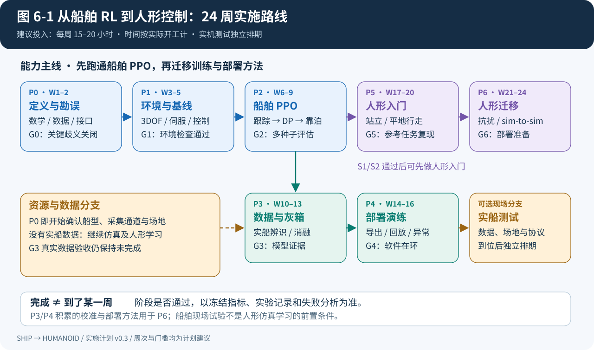
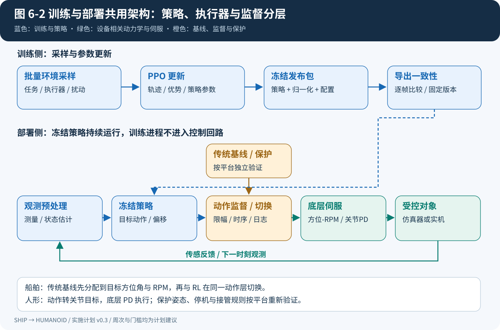
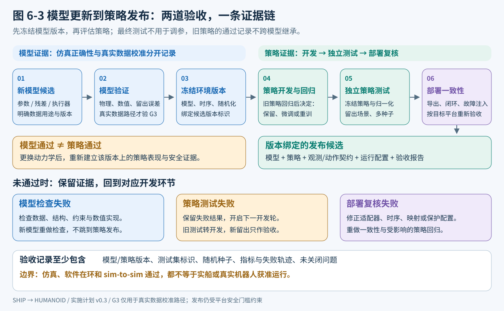
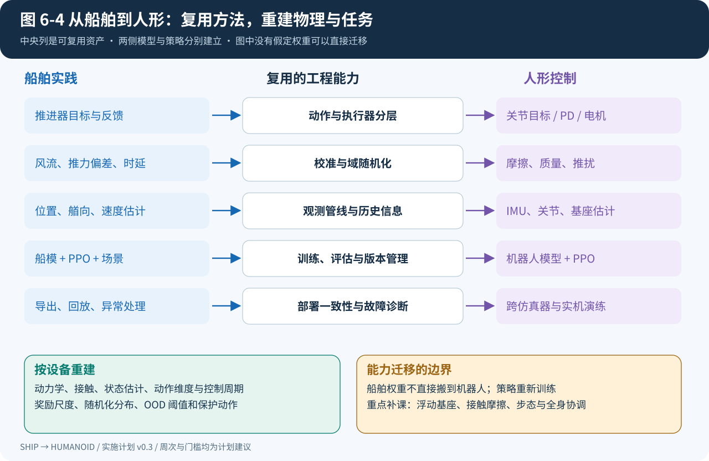

# 第 6 章：从船舶 RL 到人形机器人控制的实施计划

> 版本：v0.3｜初版日期：2026-09-15｜复查日期：2026-09-16｜状态：待执行计划
>
> 目标路线：**物理/灰箱环境 → PPO 策略 → 执行器底层闭环 → 鲁棒性验证与部署 → 人形机器人站立、行走、平衡控制。**
>
> 本章按“单人、每周约 15–20 小时、已有 Python 基础”估算 24 周学习与开发节奏，约 360–480 小时。时间为【计划估算】，阶段出口为【计划建议】，均不是已完成结果或实机放行承诺。硬件、湖试窗口和数据到位时间单独管理；无实船数据时可继续仿真与机器人学习分支。

## 6.1 计划目标与最终成果

本计划把船舶项目作为连续控制 RL 的实践入口，先建立一套能解释、能复现、能验证的训练流程，再把这套方法应用到人形机器人。船舶模型与机器人模型各自建立，重点复用训练组织、配置管理、评估方法和部署接口。

24 周主线期望形成三份成果：

1. **船舶 RL 基准包**：参数化 3DOF 环境、传统控制基线、PPO、冻结场景、多种子评估及演示视频。
2. **模型校准与部署演练包**：数据管线、灰箱增量实验、策略导出、观测/动作一致性检查、异常处理记录；数据未到位时明确标记为仿真流程验证。
3. **人形机器人控制原型包**：选定一种平台，完成基线复现、站立/平地速度跟踪、抗扰评估和跨仿真器测试。实机测试在设备与放行条件具备后独立排期。

人形阶段暂聚焦运动控制；双臂操作、灵巧手、视觉导航和语言指令任务属于后续扩展。船舶策略权重、奖励权重、动力学参数、控制频率和 OOD 阈值均不直接迁移到机器人。

**范围与进度口径**：以上为目标完整包。最低可交付成果为船舶 S1/S2 基准、通用训练/导出流程、一个人形公开参考任务复现与平地任务评估。DP/靠泊、自定义人形抗扰和真实数据校准分别记录完成度；若延期，调整其排期，不把完整 G2/G3/G5/G6 标为通过。每阶段约 20% 工时预留给定位问题与回归检查，纳入上述总工时；24 周不足时先延长阶段或明确延期项。



*图 6-1：按验收条件推进。船舶数据校准与人形入门可交错进行；船舶实机交付不作为人形仿真学习的前置条件。周次仅表示建议工作安排。*

## 6.2 技术路线与选择理由

### 6.2.1 三个选择先冻结

| 层次 | 本计划的起步选择 | 原因与升级条件 |
|---|---|---|
| 动力学环境 | 修正后的参数化 3DOF 模型，显式保留执行器动态 | 先定位仿真和接口问题；有数据后逐模块引入 NN |
| 控制策略 | PPO，优先复用成熟训练实现 | 与机器人训练生态衔接；先研究任务与数据，再研究算法变体 |
| 动作接口 | 船舶输出目标方位角/RPM；人形输出关节位置目标或偏移 | 保留底层伺服，把策略决策与电机闭环分开 |

PPO 的选择是本项目对学习成本、连续控制实践与机器人生态的权衡，不是跨任务最优性结论。RSL-RL 提供 PPO 与机器人训练接口；Isaac Lab 提供机器人环境、随机化和训练工作流，可作为后续复用入口。[RSL-RL 官方仓库](https://github.com/leggedrobotics/rsl_rl)、[Isaac Lab 官方文档](https://isaac-sim.github.io/IsaacLab/main/)

### 6.2.2 起步、校准与升级

船舶模型沿用[第 1 章](01-方法对比矩阵.md)的灰箱方向，但实施上先获得可信的参数化基线，再分别测试推进幅值、执行器动态和船体水动力的学习收益。首个 PPO 原型属于仿真开发实验；将数据辨识模型用于正式训练，仍需通过[第 4 章](04-验证协议与RL契约.md)规定的模型验收。数据不支持 NN 升级时保留通过验收的参数模型，不以使用 NN 作为阶段成功条件。

两个容易混淆的“残差”必须单独命名：

| 方式 | 网络学习什么 | 所在位置 | 本计划用途 |
|---|---|---|---|
| 动力学残差 | 已有动力学模型的预测偏差 | 仿真环境内部 | 数据校准后按需增加，单独验证模型收益 |
| 控制残差 RL | 已有控制器动作的修正量 | 控制器内部 | 有可靠基线时作为可选过渡或对照实验 |

控制残差可写为 `a_request = a_base + scale × delta_a_RL`，再通过执行器约束；方位角修正需按圆周角处理，不能直接对跨 ±180° 的角度做普通相加/裁剪。已有机器人工作验证了传统反馈与 RL 修正结合的做法，但是否适合本船要通过对照实验判断。[Residual RL 原始研究](https://residualrl.github.io/)

### 6.2.3 工具与环境选择

| 模块 | 默认选择 | 实施约定 |
|---|---|---|
| 船舶仿真 | Python/PyTorch 数值模型 | 先单环境正确，再做批量张量计算；不为船舶任务提前引入完整机器人模拟器 |
| RL 训练 | PPO，优先评估 RSL-RL | 明确其批量接口与 Gymnasium 接口之间的适配，不能假设开箱即兼容 |
| 环境语义 | Gymnasium 风格的观测、奖励、终止/截断 | 内部接口独立于训练库，记录动作变换与最终观测 |
| 人形训练 | 有兼容 GPU 时优先 Isaac Lab | 选择一款已有模型和参考任务的平台，先复现公开配置 |
| 跨仿真器验证 | MuJoCo | 校准关节顺序、惯量、接触、执行器和时间步后再对比 |
| 备选机器人入口 | MuJoCo Playground | 提供机器人训练与 sim-to-real 示例；选择前核对计算后端和依赖，不能默认等同于轻量 CPU 训练 |
| 部署与记录 | 导出策略、固定预处理配置、统一实验日志 | 导出格式按目标运行时选择；保留原模型与导出模型逐帧对照 |

MuJoCo Playground 已展示人形运动与实机迁移案例，可用作参考实现与方法学习来源。[官方项目页](https://playground.mujoco.org/)

软件环境在阶段开始时锁定稳定版本/提交、依赖、驱动和任务配置。示例代码以所选版本为准；本章不预设尚未核实的 GPU 型号或机器人采购方案。

**工具选定前的小规模验证**：先跑一个参考任务或小批量采样，记录显存、总采样吞吐、训练更新耗时和导出是否成功，再决定并行环境数。将“公开权重能推理”和“从头训练可复现”分开检查。若需要换模拟器/训练库，先完成观测与动作适配，不能将库切换造成的差异算成算法收益。

## 6.3 共用架构与动作接口



*图 6-2：蓝色为可复用的训练与策略流程，绿色为按设备重建的执行器和动力学，橙色为监督与异常处理。船舶传统控制器先完成推力分配，再在执行器目标层与 RL 切换。*

### 6.3.1 训练回路与控制回路分别管理

训练进程采样轨迹并更新参数；部署进程加载冻结策略，执行“观测预处理 → 策略 → 动作变换 → 底层控制”。实机运行不依赖训练进程持续在线。

分别记录物理积分周期 `dt_sim`、策略周期 `dt_policy` 和底层伺服周期 `dt_servo`。仿真中用策略保持与子步积分表达频率差异；切换船舶/机器人时重新标定，不能复用同一个时间步。

还需记录 rollout 的**物理时长**：`T_rollout = steps_per_env × dt_policy`。改变策略周期时重新检查折扣、GAE 和奖励尺度；例如指定折扣时间常数 `tau_discount` 后可用 `gamma = exp(-dt_policy/tau_discount)` 保持相同连续时间折扣含义，此为项目参数化建议。持续误差成本按时间积分，成功/失败事件奖励按事件计；动作平滑惩罚明确是动作增量还是变化率，不能在改频率后保留含义不明的原权重。积分步长减半检查与策略周期变化实验分别进行。

### 6.3.2 船舶起步接口

- **状态**：船体参考点的位置/艏向、对地速度，以及进入水动力计算的对水相对速度；还包括实际方位角、实际 RPM 和必要的执行器内部状态。
- **Actor 观测**：任务误差在船体系的表示、艏向误差的 `sin/cos`、可测或可估计速度、实际执行器反馈、上一动作；有明显时延时追加短历史。仿真真值与实机可观测量分别列出。
- **动作**：归一化四维目标，经配置映射为 `(alpha1_cmd, rpm1_cmd, alpha2_cmd, rpm2_cmd)`。机械限位与连续回转采用不同的角度处理规则。
- **动作执行**：记录策略原始动作、受约束后的目标、实际执行器响应三个序列。PPO 的概率比使用采样动作及对应分布，环境约束作为状态转移的一部分，不能拿裁剪后动作与原分布概率混算。
- **底层控制**：保留方位伺服、RPM 闭环、速率限制和时延模型；RL 不直接下发电流或未经定义的推力值。

传统基线需要“控制律 → 推力分配 → alpha/RPM 目标”。DP 基线应具备位置与艏向控制及可行分配，不能只拿保向 PID 当作 DP 对照。启动阶段使用执行器目标层的边界检查与监督切换；合力级 QP 是后续可选模块，若引入必须补齐前向推力映射、可行分配、误差界和求解失败行为。

### 6.3.3 人形起步接口

建议从“速度指令 + 本体感觉 → 关节位置目标”入手。候选观测包括基座角速度、机体系重力方向、关节位置/速度、指令和上一动作；线速度若在实机不可直接获得，需指定估计器，或以训练期特权信息仅供 Critic 使用。

动作示意：

```text
q_target = q_reference + action_scale × a_policy
tau = Kp × (q_target - q) + Kd × (dq_target - dq)
```

`q_reference` 可是默认姿态或经验证的参考动作，随任务配置。关节 PD 的存在不等于已有稳定步态控制器，也不自动构成“控制残差 RL”。关节限位、速度/力矩限制与电机模型按平台定义；机器人异常时的保护姿态或停机序列要单独验证，不能照搬船舶 PID 回退。[Unitree 官方 RL 与部署参考](https://github.com/unitreerobotics/unitree_rl_gym)

位置策略若没有定义目标速度，`dq_target` 在配置中显式指定（例如零），不能由通信接口任意补值。PD 在电机驱动器或控制软件中的执行位置也要记录，防止重复施加两层 PD。

### 6.3.4 观测、重置与部署一致性检查

| 检查项 | 起步约定与交付证据 |
|---|---|
| 坐标与单位 | 船舶遵循第 2 章 x 向艏、y 向右舷、z 向下约定，原始 α 先校准为数学力方向 θ；另写明 NED/ENU、机器人机体坐标、四元数排列，不能直接沿用船体轴定义；角度与 RPM/转每秒显式换算并保存数值示例 |
| Actor/Critic 信息 | 逐字段记录数据源、量纲、时延、训练/实机是否可得；真实流速、质量、摩擦等不可测真值不得直接进入部署 Actor |
| 归一化 | 训练统计、裁剪范围及缺失值规则随策略发布；验证和部署冻结统计，禁止再次归一化或悄悄更新均值方差 |
| 关节/执行器映射 | 名称到索引、旋转正方向、零位、动作尺度、限位、增益和力矩单位逐项对照；通过单执行器小动作回放验证 |
| 历史与隐状态 | 重置历史窗口、延迟队列、滤波器、上一动作、控制器积分和 RNN 状态；只影响结束的子环境；启动的历史填充规则与部署一致 |
| 初始状态 | 船舶状态与实际执行器状态相容；人形姿态、接触与参考任务一致，剔除初始穿透等无效配置并记录原因 |
| 指令与状态时效 | 区分测量时间、接收时间、指令生成时间和执行器反馈；拒绝乱序/过期消息，指令保持与超时动作明确 |
| 模式与接管 | 监督器和传统基线也接收有效观测；切换时处理积分项、历史和目标连续性，恢复 RL 前重新通过状态检查 |

批量环境适配必须核对 autoreset 模式：结束步的最终观测与下一回合初始观测不能混用；截断 bootstrap 使用前者。Gymnasium 不同重置模式需要训练适配器匹配，不能仅凭张量形状正确判断接口正确。[Gymnasium 向量环境文档](https://gymnasium.farama.org/api/vector/)

## 6.4 24 周实施安排

所有阶段初始状态均为“待开始”。阶段负责人默认由项目实施者承担；需要现场船舶参数、设备操作或试验组织的工作，另列依赖联系人。周次从实际开工开始计，不以本文编制日期自动计算截止日。

| 阶段 | 建议周次 | 核心工作 | 交付物 | 出口 |
|---|---|---|---|---|
| P0 定义与勘误 | W1–2 | 统一坐标、力矩、辨识边界、数据用途、接口 | 数学定义 v0.1、数据字典、问题关闭表 | G0：关键歧义已消除 |
| P1 环境与基线 | W3–5 | 参数化船模、执行器、单环境/批量环境、传统控制 | 环境 v0.1、基线、回归场景与录像 | G1：物理和接口检查通过 |
| P2 PPO 主线 | W6–9 | 速度/保向 → DP → 简化靠泊；多种子评估 | PPO v0.1、学习曲线、冻结评估报告 | G2：仿真任务通过 |
| P3 数据与灰箱 | W10–13 | 数据处理、参数辨识、单模块 NN、随机化 | 数据/模型版本、消融与误差报告 | G3：校准收益证据；无数据则保留为仿真验证 |
| P4 部署演练 | W14–16 | 导出一致性、实时回放、异常注入 | 部署包、时延报告、监督状态机 | G4：软件部署演练通过 |
| P5 人形入门 | W17–20 | 复现一个公开任务；站立、平地速度跟踪 | 人形训练环境、策略与评估录像 | G5：参考任务和自定义任务通过 |
| P6 人形迁移 | W21–24 | 扰动、模型差异、sim-to-sim、部署准备 | 跨仿真器报告与实机测试草案 | G6：迁移差异可解释、部署包齐全 |

P3 的船舶数据获取从 P0 就开始准备；W10–13 是集中分析窗口。G2 通过后可以开始 P5；若仅 S1/S2 通过同等级评估，也可先开展机器人参考任务学习，但应写“G2 部分完成”，DP/靠泊验收继续保留。P3 因湖试延期时，先推进这些工作；G3 的真实数据验收仍保留为未完成，不能以仿真成绩代替。单人交错安排时按周移动工时，不把两条分支都算成同时满负荷完成。

| 工作依赖 | 前置证据 | 可以继续的边界 |
|---|---|---|
| P2 开始训练 | G1 对当前任务通过 | 扩展到 DP/靠泊前，为新任务另补合格基线和场景 |
| P3 接收真实数据 | G0 数据字典与航次划分规则 | 未通过质检的数据只用于诊断；营运留出数据不参与本轮拟合 |
| P4 软件演练 | 选定且版本冻结的模型/策略 | 可使用 G2 仿真原型演练，但不因此通过 G3 或实船放行 |
| P5 参考任务学习 | 船舶 S1/S2 已完成训练、评估及失败诊断 | 不等待船舶湖试；完整人形里程碑仍按 G5 验收 |
| P6 跨仿真器与发布 | G5、机器人接口检查、平台动作映射 | 可复用 P4 方法；机器人策略的导出/时延/异常检查必须重做 |
| 任一实机分支 | 对应数据与模型证据、平台部署检查、现场协议 | 完成软件步骤不自动授权现场试验 |

### P0：先关闭影响实施的文档问题

| 问题来源 | 本阶段要完成的工作 | 关闭证据 |
|---|---|---|
| 第 2 章推力–阻力分离 | 承认 `T_eff+g(u)`、`R+g(u)` 的函数歧义；规定固定参数、锚定与模型结构 | 推导、参数表、合成反例；不把运动拟合等同于分量可辨识 |
| 第 2/3 章双机机动（旧 L4） | 按正文修订后的公式代入本船两机位置，区分镜像角纵向合力与横向/艏摇耦合 | 分配矩阵、符号检查、预期合力表与实际参数来源 |
| 第 3 章采集 | 区分对地/对水速度、精度/分辨率、指令/反馈；修正量化平均前提 | 数据字典、单位与时标检查规则 |
| 第 3/4 章划分 | 机动类型用 M01–M07；航次 ID 与数据用途分开 | 每条航次记录的唯一数据角色；同类机动可分布于不同数据组，但同航次不跨组；先分组再滤波/切窗 |
| 第 1/4 章稳定性 | 解析结构仅保证几何关系；增加模型约束及回退定义 | 静水能量检查、步长收敛方案、域外处理说明 |
| 第 5 章动作/保护 | 固定起步策略为执行器目标输出；传统基线分配后再切换 | 控制架构、各信号单位、切换日志字段 |

2026-09-16 已将上述概念和协议勘误回写至相应正文，详见[文档复查记录](文档复查记录.md)。本表仍保留为实施准入清单：正文修订不等于本船参数已核实、实验已执行或 G0 已通过；关闭时须补齐所列证据。P0 冻结定义与测试预期，P1 才执行仿真回归，二者不混记进度。

### P1：把环境做成可检查的工程对象

先完成静水零输入、单机推力、双机对称、推力方向翻转、执行器阶跃等小场景，再加入任务。固定质量、惯量、附加质量的来源和不确定范围；有效推力与真实桨推力分别命名。

环境至少检查：量纲与符号一致；静水无推进且初态静止时不自行运动；执行器受限；单环境与批量环境结果在数值容差内一致；重置不串扰其他环境；两档积分步长的任务指标差异在预设容差内。物理简化必须记录适用速度/角度范围。

传统控制基线按同一任务、同一执行器限制整定并冻结。没有通过任务绝对误差要求的基线，不能作为“PPO 只需优于它”的验收捷径。

### P2：建立连续控制 PPO 的基本功

学习顺序为：状态/动作/奖励与回报 → Actor-Critic → 优势估计与 GAE → PPO 概率比与裁剪 → 批量采样与重置 → 日志诊断。先阅读并运行成熟实现，再做一项可解释的修改。

船舶任务按 S1 速度跟踪、S2 保向、S3 定点保持、S4 简化靠泊逐级增加；S4 明确终端位置、艏向和速度。初版不模拟接触后的力学，但必须用船体外形/保守包络与岸线、障碍物计算净距和碰撞，不能仅检查质心是否越界。浅水、岸壁水动力和系泊接触若未建模，应限定作业距离与域范围，在数据验证前不宣称覆盖真实贴岸过程。每次增加难度保留旧场景作回归。

奖励可从无量纲误差的加权和起步：`r = -w_p*e_p² - w_psi*e_psi² - w_v*e_v² - w_a*delta_a² + r_success`。各误差按任务尺度归一化；只启用当前任务有意义的项。动作变化惩罚不是功率测量；碰撞/越界等失败也必须进入独立统计，不能只体现在总奖励中。

先在默认 MLP、固定 PPO 配置上建立结果，再研究短历史、控制残差或网络规模。学习曲线至少包含回报、任务成功率、各奖励分项、动作饱和率、KL、熵和价值误差。

PPO 配置至少冻结：环境数、每环境 rollout 步数、更新轮数、minibatch、学习率、`gamma`、GAE 系数、clip 范围、熵系数、梯度限幅、Actor/Critic 结构与动作分布。起步沿用所选实现的参考值，每轮只改变有假设的一组参数；训练采样采用随机策略，评估是否使用确定性动作在报告中明确，不能混合统计。[PPO 原始论文](https://arxiv.org/abs/1707.06347)

课程学习用开发场景确定升级条件，并保留早期任务采样比例。奖励审查加入“原地不动、主动触发终止、反复切换动作、靠保护器代跑”等对照轨迹，确认短回合或大成功奖励不会掩盖任务失败。仍不会收敛时先回到 G1 检查符号、尺度、重置与基线，不同时扩大网络并改奖励。

### P3：让数据决定灰箱增加的位置

真实数据处理顺序为“不可变原始记录 → 按航次冻结划分 → 各组内对齐/滤波 → 状态重构 → 参数辨识 → 模型验收”。归一化统计只来自训练集；离线平滑可以用于辨识，但不能把未来信息偷偷加入部署侧观测。

比较三组模型：`M-EMP` 经验参数基线、`M-ID` 同船数据辨识基线、`M-HYB` 单模块灰箱。控制器另用 `C-BASE` 传统控制、`C-PPO` PPO、`C-RES` 可选控制残差命名，与船舶任务 S1–S4、人形任务 H1–H4 分开。先辨识执行器与有效推进映射，再判断船体残差是否必要；不要同时放开所有 NN 和干扰系数。具体训练损失、固定参数和物理约束在 P0/P3 的模型说明中冻结。

按 10/30/100 s 自由滚动及任务相关闭环指标对照，并报告失败、不可辨识参数组合和不确定度。质量/推力参数、风流、噪声及时延随机化以实测或辨识范围为依据；没有真实数据的范围标记为假设。

模型 OOD 阈值用独立校准数据确定。域内测试用于准确性，域外压力测试用于失效行为；同一 OOD 分数不能同时充当模型精度、未来可达性和实机安全的证明。若部署任务会触及模型禁区，应限制任务或补数据，而不是继续外推。

**模型更新后的必经环节**：新灰箱、执行器或随机化配置通过模型检查后，冻结为新的环境版本，先回归评估旧策略，再按开发结果决定原样保留、微调或重训。重训后的策略重新进行留出场景评估和部署一致性检查；P2 的通过记录不能跨环境版本自动继承。即使策略权重不变，也要重签“模型—策略—任务域”的兼容记录。



*图 6-3：模型通过与策略通过是两个验收点。测试暴露问题后转入下一开发轮，原测试结果保留；改过模型或策略后，重新建立独立的最终验收证据。*

### P4：部署演练与实船分支

将策略、归一化、动作尺度、执行器顺序、控制周期和版本信息一起导出。用固定观测序列比较原模型与导出模型，再以软件在环闭环回放测试时延、动作保持、丢帧和异常值。

这里的“软件在环闭环”是策略接收仿真器实时状态并重新生成动作。固定动作日志回放属于开环诊断；固定观测回放用于检查推理一致性，二者不能替代闭环任务评估。后续硬件在环用目标控制计算机接仿真对象，检查真实通信和调度链路；实际平台连接之前仍需单独完成设备检查。

监督状态至少包括“初始化检查、基线控制、RL 控制、降级、人工接管”。给每个转换写出触发条件、迟滞/持续时间、动作连续性处理和记录字段；实船一阶执行器模型不能代替物理急停链路。异常处置要覆盖已验证的 DP/离岸/减速等具体目标。

| 异常注入 | 要验证的行为 | 必存证据 |
|---|---|---|
| 观测过期、乱序、丢帧、NaN | 识别无效输入并进入预定模式；不得把无效值直接送入策略/伺服 | 注入时间、检测时延、模式和最终动作 |
| 推理超时、进程退出、通信中断 | 独立看门狗按平台协议处理，验证实际动作保持/停止行为 | 最大响应时延、命令队列与接管记录 |
| 执行器饱和、卡滞、反馈偏差 | 根据任务域执行降级；避免积分累积与持续争夺控制权 | 请求/施加/实际响应三序列 |
| 模型 OOD 或任务包线越界 | 触发独立计数和已定义处置；自动恢复需有效状态与显式恢复条件 | OOD 分数、阈值版本、切换原因 |
| 模型或关节映射版本不匹配 | 加载时拒绝进入运行状态 | 版本清单、校验结果、拒绝日志 |

最大可接受响应时延、允许丢帧数、持续饱和时间和恢复条件应在任务/平台配置中填写；没有确定限值的项目标为未通过。P50/P99 等分位统计不能代替硬截止时间检查。

G4 只代表软件部署演练通过。实船分支仍需任务边界、现场水域与装载、接管链路、故障处理及专门试验协议齐备，再按受控执行器验证、低速自由航行、DP/靠泊任务逐步测试。详细放行协议是本阶段交付物之一，见[第 5 章](05-RL取代传统控制律可行性评估.md)的范围讨论。

### P5：把流程迁移到人形平台

只选一种平台、一套模拟器和一个参考任务开始。先重现公开配置的指标和动作尺度，再改变观测或奖励。机器人模型需要检查关节轴、关节顺序、质量/惯量、碰撞体、默认姿态与电机限制。

平台选择记录至少包含模型/配置来源与许可证、目标任务、可用算力、参考代码版本、预训练权重与从头训练入口、实机 SDK 是否可得。不要为了统一工具而跳过已有可复现参考任务。

任务顺序建议 H1 站立、H2 平地前后行走、H3 转向/侧向指令、H4 抗推扰。保留底层 PD；不从电流级或无约束力矩控制起步。每次扩展任务，都回归站立与低速场景。

人形训练另明确：足部允许接触面与非足部碰撞、基座高度/倾角的跌倒条件、自碰撞配置、关节速度与扭矩—转速限制、摩擦模型、地形及推扰施加位置/持续时间。随机化起步覆盖实测或合理界限内的电机强度、增益、时延和质量偏差，训练/留出组合分别保存；不要把所有扰动叠成无法恢复的初始难度。没有能耗测量时，力矩/机械功统计标为代理量。

理论补课围绕当前错误展开：刚体变换 → 运动学/Jacobian → 浮动基座动力学 → 接触与摩擦 → 状态估计与稳定性。单独设置每周两次学习时段，避免只会修改奖励却无法解释跌倒原因。

### P6：验证迁移，准备实机

先随机化已识别的参数与扰动，再做另一仿真器的同策略评估。跨仿真器只替换受控对象及必要适配，冻结策略、观测顺序和任务指令；记录碰撞几何、摩擦、求解器、PD 实现与时间步差异。

逐项比较站立偏置、关节跟踪、速度跟踪、接触模式和跌倒率。跨仿真器通过只能增加可信度，不能代替实机证据。实机初次测试的约束空间、保护机制、设备操作与停止条件必须按所选机器人平台另行定义；不把通用“关节归零”当作通用保护动作。

## 6.5 验收门槛与评估纪律

### 6.5.1 先冻结场景，再计算成功率

每个任务建立一个评估场景表，至少包含初始状态、目标指令、扰动序列、装载/参数条件、仿真时长与采样率。误差计算写明参考坐标系、角度环绕、统计窗口和单位。

| 任务 | 成功定义需要填写的参数 | 必报指标 |
|---|---|---|
| 速度/保向 | 速度/艏向容差、进入容差时间、保持时间 | RMSE、最大误差、动作饱和、收敛时间 |
| DP | 位置/艏向容差、保持时长、扰动条件 | 位置与艏向误差、恢复时间、越界/干预率 |
| 靠泊 | 终端位置/姿态/速度、完成时限、最小净距 | 成功率、碰撞率、终端误差、接管率 |
| 人形站立 | 姿态/高度范围、站立时长、接触允许集 | 跌倒率、姿态误差、关节饱和、足部滑移 |
| 人形行走 | 指令速度范围、跟踪容差、持续时间 | 速度误差、跌倒率、动作变化、力矩饱和 |

上述物理阈值在相应阶段开始时按船型/机器人及任务需求填写。本计划不虚构未提供设备条件下的米级、牛米级或停车距离指标。

### 6.5.2 开发期建议门槛

下列数字为【计划建议】，用于仿真开发检查，不作为行业标准或实机许可条件：

| 出口 | 检查内容 | 建议判据 |
|---|---|---|
| G0 | 定义、勘误、范围 | §6.4 P0 每条均有关闭记录；缺失船型参数已标为假设 |
| G1 | 环境与基线 | 物理/接口回归检查通过；基线达到预先冻结的任务绝对阈值 |
| G2 | 船舶 PPO | 每任务 5 个训练种子，各评估同一套 100 场景；各种子成功率建议 ≥95%，失败全部计入 |
| G3 | 数据模型 | 真实数据分组测试及开闭环阈值通过；灰箱升级须体现预先选定指标的收益且无关键指标明显退化 |
| G4 | 软件部署演练 | 导出数值误差容限内一致；记录端到端 P50/P95/P99/最大时延与超时率；异常处置符合冻结协议 |
| G5 | 人形原型 | 参考任务复现；自定义任务按 5 种子 × 100 场景报告，站立/平地任务各种子成功率建议 ≥95% |
| G6 | 跨仿真器 | 达到同一绝对任务阈值；建议成功率下降 ≤5 个百分点，任何新增失效模式完成定位 |

控制器比较除绝对任务阈值外，可先设“主要跟踪 RMSE 不超过合格传统基线的 1.05 倍，并至少改善一个预先选择的次要指标”为开发期非劣效目标；它不等于已经证明 RL 更优。阈值、统计方法和比较对象必须在看测试结果前冻结。

场景成功率与种子间散布分别报告，不能把 500 次相关评估简单当成完全独立样本。报告每个种子、每类场景及最差组结果；实际有多少试验就报告多少。

**比较口径补充**：100 场景/种子是开发期建议评估规模，不意味着 95% 成功率已经得到统计保证。对场景配对比较并给出置信区间；若使用 bootstrap，按任务的依赖结构选择场景/航次分组并报告种子散布，不能按每一帧当作独立样本。安全过滤或基线接管后的任务成功记作“受监督系统成功”，同时报告“RL 无接管成功率”、过滤频率/幅度和降级次数，不能将基线完成的任务归功于 RL 独立完成。

RMSE 对提前终止的轨迹只统计有效前缀，同时报告覆盖时长与终止原因；不能拿更短失败轨迹的低 RMSE 与完整成功轨迹直接排名。安全边界违规和工程故障均进入总场景结果，必要时单列条件误差统计。

### 6.5.3 终止、截断和奖励不能混用

任务成功、碰撞和跌倒可按任务定义设为终止；采样用的外部时间上限通常为截断，并保留最终观测供正确计算 bootstrap。任务本身有硬截止时间时，应把剩余时间纳入状态/观测并按有限时域任务定义处理。[Gymnasium 时间限制说明](https://gymnasium.farama.org/tutorials/gymnasium_basics/handling_time_limits/)

模型 OOD 单列 `end_reason` 与 `valid_transition`。本计划起步环境把主动越过可用模型边界定义为失败终止，禁止在无可信状态处继续积分或计算未来价值；若后续采用其他建模方式，要重新定义 bootstrap 规则。求解器 NaN、状态重构失败等属于工程故障，独立计数并检查无效样本处理，不能包装成任务成功或随意过滤掉。

### 6.5.4 模型数据、策略场景与最终测试分别冻结

| 证据对象 | 开发时可使用 | 最终验收保留 | 禁止混用 |
|---|---|---|---|
| 动力学模型 | `model_train` 拟合、`model_val` 选型 | 按航次留出的 `model_test` | 不跨组滤波/切窗，不用测试轨迹反复拟合 |
| OOD | 模型训练索引、独立 `ood_calibration` 标阈 | 留出域内/域外检测样本 | 不使用最终测试集调 k、阈值或投影规则 |
| RL 策略 | `policy_train` 随机场景、`policy_dev` 奖励/课程/checkpoint 选择 | 冻结的 `policy_test` 初态、指令与扰动组合 | PPO 能查询的仿真器与开发场景不能称为隐藏测试环境；不挑选有利训练种子替代多种子报告 |
| 泛化验证 | 预先确定的真实数据审计或第二模拟器开发检查 | 未用于本轮调参的场景/航次或第二模拟器留出组合 | 看过失败并用于改模型/策略的数据，下一轮标为开发证据 |

日常迭代、挑 checkpoint 和课程升级只看开发集；发布候选冻结后再运行最终测试。若最终测试失败，保留报告，进入下一轮开发，重新准备独立留出证据，不能覆盖失败记录或反复调到通过后仍称“盲测”。软件回归集可以重复运行，但其角色与最终测试集分开。

`M-ID` 与 `M-HYB` 共用结构和数据，适合作为交叉检查而不构成完全独立真值。实船记录提供模型外部证据；人形第二仿真器提供不同接触/求解实现下的证据，仍需另行核对共同参数偏差。营运数据若未来转作增量训练，须升版数据角色并补建泛化留出集。

## 6.6 哪些能力复用，哪些重新建立



*图 6-4：中间层是方法与软件接口的复用。两侧的物理模型、动作维度和安全边界各自重建；复用不意味着参数与策略权重可以直接搬运。*

| 船舶阶段积累 | 人形阶段对应能力 | 复用方式 |
|---|---|---|
| 动作目标与实际执行器响应分开建模 | 关节目标、PD、电机饱和与时延 | 复用接口分层，替换执行器模型 |
| 风流/参数扰动评估 | 地面摩擦、质量、推扰、电机偏差 | 复用随机化配置机制，重新确定分布 |
| 状态估计与观测历史 | IMU、关节本体感觉、浮动基座估计 | 复用处理与版本管理，重建估计器 |
| PPO、日志和多种子评估 | 人形策略学习与回归评估 | 复用训练框架，重新训练策略 |
| 数据/模型/策略绑定发布 | 机器人模型与控制配置发布 | 复用清单与一致性检查 |
| 保向、DP、靠泊任务分级 | 站立、行走、转向、抗扰任务分级 | 复用课程学习方法，重写任务与奖励 |

重点新增的知识是接触动力学、欠驱动浮动基座、步态切换与全身协调。人形机器人可能在一步接触变化后发生失稳，船舶慢响应任务得到的控制周期、动作平滑权重和降级逻辑都应重新设计。

## 6.7 工作组织、依赖与交付目录

### 6.7.1 每周工作节奏与进度调整

建议将投入分成约 20% 理论与源码阅读、50% 实现和实验、20% 评估诊断、10% 文档与复现。每周至少保存一个“配置 → 结果 → 解释”的完整实验；失败实验记录同样保留。

连续两次周复盘没有改善目标指标时，先做错误归因：环境/单位/接口 → 观测可用性 → 动作可达性 → 奖励与终止 → PPO 配置 → 模型误差。选一项形成最小实验。阶段末未通过出口时，登记剩余问题与新排期；转入其他学习分支不会自动关闭原阶段。

| 学习节点 | 最低前置能力 | 自检产物 |
|---|---|---|
| P0/P1 | Python 数组、基本线性代数、坐标变换、常微分方程积分 | 手算双机合力/力矩，与数值结果对照 |
| P2 | PyTorch 前向/梯度、MDP、价值函数、GAE 与 PPO 更新 | 用一条短轨迹核对奖励、终止与 return/advantage |
| P3/P4 | 参数辨识、时序数据划分、采样与时延 | 一个合成已知系统的辨识实验及导出逐帧比较 |
| P5/P6 | 刚体运动学、浮动基座、接触/摩擦、PD 与本体感觉 | 单关节映射、站立接触与扰动恢复的诊断记录 |

前置能力不足时将相应阶段延长。每周学习时间来自本计划总工时，不额外假设夜间或周末无成本补齐。

| 外部条件 | 何时需要 | 缺失时继续做什么 |
|---|---|---|
| 船型、推进器与执行器参数 | P0/P1；实船校准前必须核实 | 用明确标注的假设参数完成开发检查 |
| 湖试/营运数据及元数据 | P3 真实数据验收 | 完成合成数据管线测试，推进 P5；不宣称实船精度 |
| 可用计算资源 | P2 批量训练、P5 人形训练 | 先做单环境与小批量；实测资源后调整并行数与排期 |
| 人形平台与参考任务 | P5 | 先选一个公开仿真模型，避免同时维护多平台 |
| 船舶/机器人设备与现场条件 | 独立实机分支 | 完成软件在环和跨仿真器测试，设备到位后再排现场工作 |

单次实验记录总环境步数、环境并行数、采样墙钟时间、更新墙钟时间、显存/内存和端到端时延。“总步数 / 总采样吞吐”才是采样时间估算依据，不能把总步数误当成每环境步数后再重复乘并行数。

### 6.7.2 实验最小记录与发布证据

每次实验保存 `run_id`、任务 ID、模型 ID、控制器 ID、代码/依赖版本、训练与评估种子、数据角色、奖励版本、观测/动作配置、时间步、随机化范围、总步数、墙钟时间、checkpoint 选择依据及失败原因。文件中引用清单/配置路径和校验值，避免仅凭截图或终端输出追溯实验。

每个阶段出口保存一条记录：`gate_id / artifact_version / required_tasks / status / evidence_paths / unresolved_items / reviewed_at`。状态只用“未开始、进行中、部分完成、通过、未通过、等待外部条件”；“通过”须与具体版本和任务集合绑定。所有字段在实施时填写，不预填虚构的通过日期、审查人或指标。

未来实施目录建议如下；这是规划结构，当前不表示这些代码已经存在：

```text
control_rl/
├── core/             # 公共观测/动作约定、版本清单与日志
├── envs/ship/        # 船舶动力学、执行器和任务
├── envs/humanoid/    # 机器人模拟器与任务适配
├── controllers/      # 传统控制基线、分配与可选控制残差
├── training/         # PPO 接口、采样和训练配置
├── evaluation/       # 冻结场景、指标与报告
├── deployment/       # 导出、观测适配、监督与设备通信
├── configs/          # 模型/任务/执行器/随机化配置
└── tests/            # 物理、接口、重置和部署回归检查
```

每份发布包至少绑定：代码提交、依赖锁定、模型/数据版本、训练种子、任务及奖励配置、观测顺序与归一化、动作尺度及执行器顺序、控制周期、策略权重、导出结果和评估报告。船舶与人形策略使用不同标识，防止加载错误。

### 6.7.3 任务冻结与缺失项处理模板

任务配置至少包含下列字段。示例中的 `null` 表示未填写，不能进入正式验收；可在开发实验中采用显式标注的假设值，不能悄悄使用默认值。这里是未来配置的模板，并非已有软件接口或本船参数。

```yaml
task_id: S1
config_version: null
status: draft
scope: simulation_only
platform_model_version: null
coordinate_and_units_ref: null
observation_action_contract_ref: null
timing: {dt_sim_s: null, dt_policy_s: null, dt_servo_s: null}
scenario_manifest: {development: null, final_test: null}
criteria:
  tracking_tolerance_with_units: null
  settling_time_s: null
  hold_duration_s: null
  task_deadline_s: null
  safety_boundary_ref: null
termination_and_truncation_ref: null
fault_and_takeover_protocol_ref: null
baseline_version: null
review_evidence_ref: null
```

任务不使用某字段时，显式标 `not_applicable` 并说明理由；配置改变需新版本和受影响测试清单。模型、策略、部署三类结论各自写出“通过哪些任务/范围、未覆盖什么”，不使用无范围的“已验证”标签。场地、设备或数据尚未到位时，可以完成文档冻结，不能以空报告替代实验。

## 6.8 第一轮两周待办

- [ ] 依据文档复查记录建立 §6.4 P0 证据表，将已修订的几何与坐标公式代入本船参数。
- [ ] 填写船型/执行器参数表：已知值、来源、不确定度和假设值分别记录。
- [ ] 冻结第一个任务：速度跟踪或保向；写出成功条件和失败条件。
- [ ] 定义指令与反馈、对地与对水速度、角度环绕及时间基准。
- [ ] 确定 PPO 实现与环境适配方式，记录软件版本和资源实测方法。
- [ ] 定义第一组静水、单机、双机与执行器阶跃场景及预期结果，交 P1 实现。
- [ ] 规划 train/val/calibration/test 的航次分组规则与仿真随机种子表。
- [ ] 分开模型训练/验证/测试、OOD 校准、策略开发/最终评估场景；建立实验与出口记录模板。
- [ ] 写出批量环境结束步、autoreset 与历史状态清理的测试样例，明确奖励与控制周期的关系；P1 执行验证。
- [ ] 给第一阶段创建一个可复现交付模板：参数表、检查结果、曲线与短视频。

完成这些待办后进入 P1。人形机器人采购、复杂 NN 水动力联合辨识、全身技能与视觉任务均不占用这一轮的主线时间。

## 6.9 阅读材料与维护

| 材料 | 何时使用 | 本计划采用的内容 |
|---|---|---|
| [第 2 章：可辨识性](02-可辨识性分析.md)、[第 3 章：试航设计](03-试航设计与数据需求.md) | P0、P3 | 按修订后的函数歧义、推进几何与数据协议补实船参数和证据 |
| [文档复查记录](文档复查记录.md) | P0、每轮变更 | 对照已修正文义与待验证事项，不把文档完成记作实验通过 |
| [第 4 章：验证与 RL 契约](04-验证协议与RL契约.md)、[第 5 章：RL 可行性](05-RL取代传统控制律可行性评估.md) | P2–P4 | 模型验证、有效域和实机分支的背景 |
| [RSL-RL](https://github.com/leggedrobotics/rsl_rl) | P2 | PPO 实现、机器人训练接口与配置实践 |
| [Gymnasium 时间限制](https://gymnasium.farama.org/tutorials/gymnasium_basics/handling_time_limits/) | P1–P2 | 终止、截断及 bootstrap 语义 |
| [Gymnasium 向量环境](https://gymnasium.farama.org/api/vector/) | P1–P2 | 自动重置模式、批量接口和结束步观测 |
| [PPO 原始论文](https://arxiv.org/abs/1707.06347) | P2 | 采样与更新流程、策略概率比及裁剪目标 |
| [Residual RL](https://residualrl.github.io/) | P2 可选实验 | 传统反馈与 RL 动作修正的组合 |
| [Isaac Lab](https://isaac-sim.github.io/IsaacLab/main/) | P5 | 环境、任务、随机化及训练组织 |
| [MuJoCo Playground](https://playground.mujoco.org/) | P5–P6 | 人形运动与 sim-to-real 示例 |
| [Unitree RL 项目](https://github.com/unitreerobotics/unitree_rl_gym) | P5–P6 | 平台配置、策略到仿真/实机的部署参考 |

本章工具入口核对日期为 2026-09-15；2026-09-16 复查重点为跨章节勘误和实施依赖，不表示所有外部文献已重新核查。本章引用其能力与方法，不承诺未来版本接口不变。计划调整时同步记录原因、受影响阶段和新的出口条件。

四幅配图为本仓库可编辑 SVG：路线图、架构图、迁移图、模型更新与策略发布验收图位于 `research/assets/06-*.svg`，普通支持本地图片的 Markdown 预览即可显示。修改阶段名称、动作层级或迁移边界时，图与正文必须同步。

### 修订记录

| 版本 | 日期 | 主要变化 |
|---|---|---|
| v0.1 | 2026-09-15 | 建立 24 周阶段路线、三幅配图、初版验收与起步清单 |
| v0.2 | 2026-09-15 | 补模型升级后的策略回归/重训、独立测试划分、批量重置与时间尺度、部署故障检查、人形接触/电机约束及部分完成口径；新增验收流程图 |
| v0.3 | 2026-09-16 | 将 P0 概念勘误回写至原章节并链接复查证据；同步 M01–M07/航次用途与坐标约定，分开 P0 定义和 P1 测试，补任务冻结模板；工程门槛仍待实证 |
